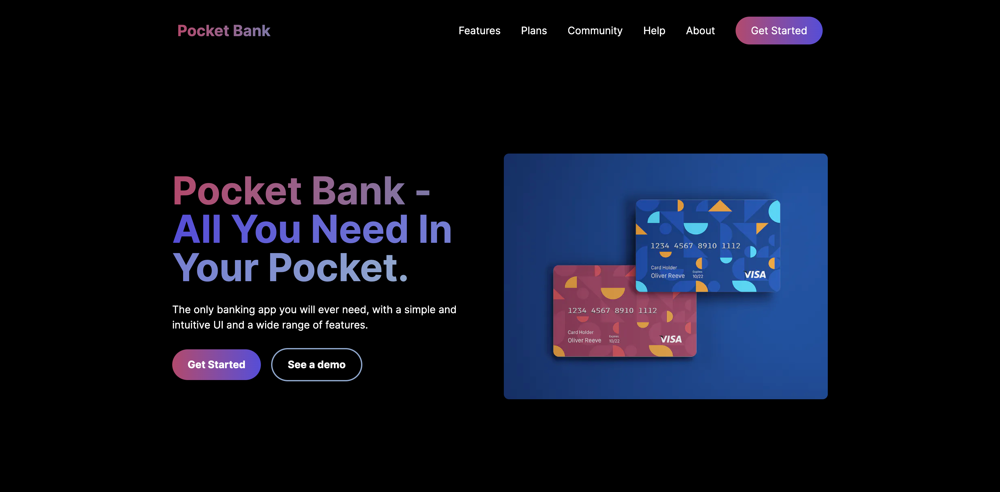

# Pocket Bank

The application is a fake bank account management system. It allows to create an account, deposit and withdraw money, and check the balance.

## Purpose

The purpose of the application is to learn Next.js 13.4 and use the tiny, one file, open-source Backend-as-a-Service (BaaS) called [PocketBase](https://pocketbase.io/).

## Demo

A demo is available at [https://pocket-bank.vercel.app](https://pocket-bank.vercel.app).

## Screenshot

## Used technologies

- 🎁 Repository: regular Git repository,
- 🧰 Framework: Next.js 13.4,
- 🛠️ Tools: not yet,
- 🎨 Styling: tailwind CSS,
- 💎 Others: mobile-first, responsive design.

## PocketBase

PocketBase is a tiny, one file, open-source Backend-as-a-Service (BaaS). It is a simple, lightweight, and easy to use database that can be used to store and retrieve data for your applications. It is a great alternative to Firebase, Airtable, and other BaaS (appwrite.io, supabase.io, etc.).

In this repository, PocketBase file (version for ARM architecture) and its config files are located in the `pocketbase` folder.

To start the PocketBase server, run the defined following command:

1. Run the PocketBase server: `pnpm run pocketbase`,
2. Navigate to [http://127.0.0.1:8090/_](http://127.0.0.1:8090/_) to access the PocketBase dashboard.

## How to start

1. Clone the repository,
2. Install Node.js,
3. Install dependencies with `npm i`,
4. Run the project with `npm run dev`,
